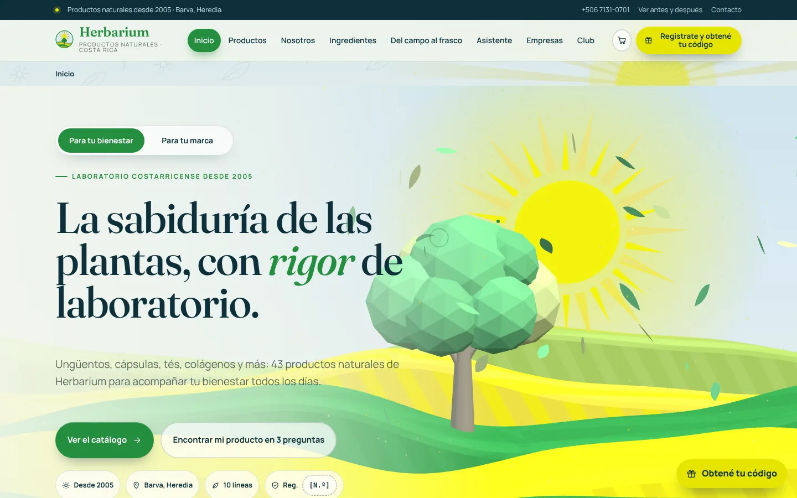
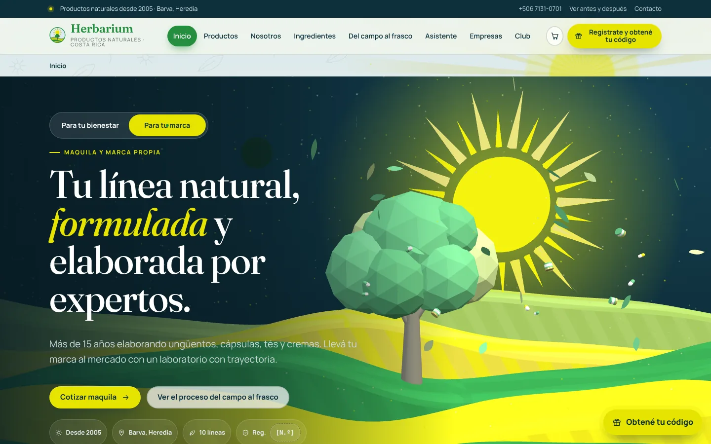
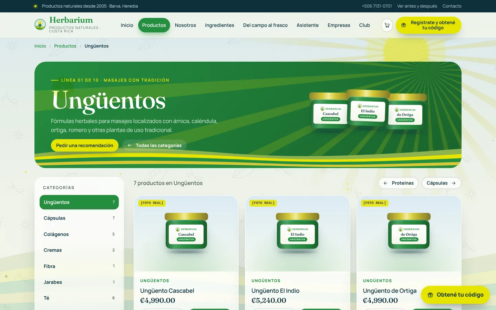
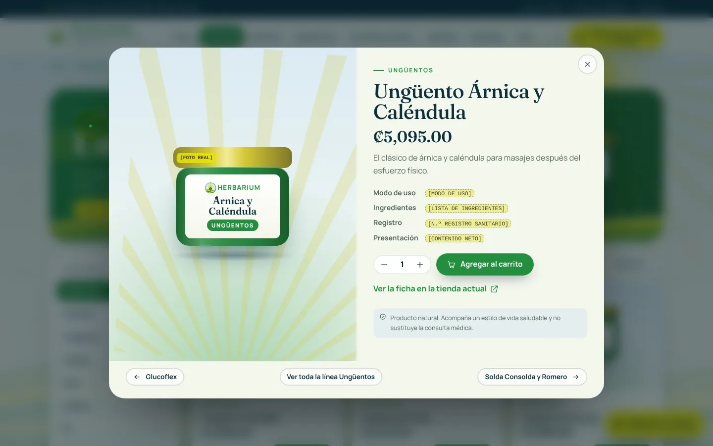
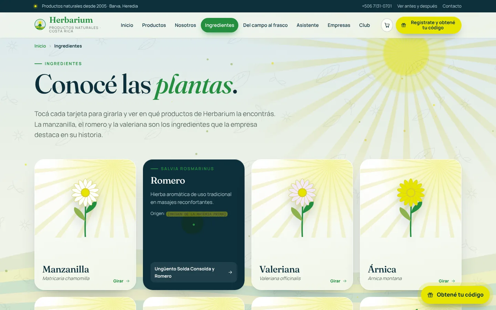
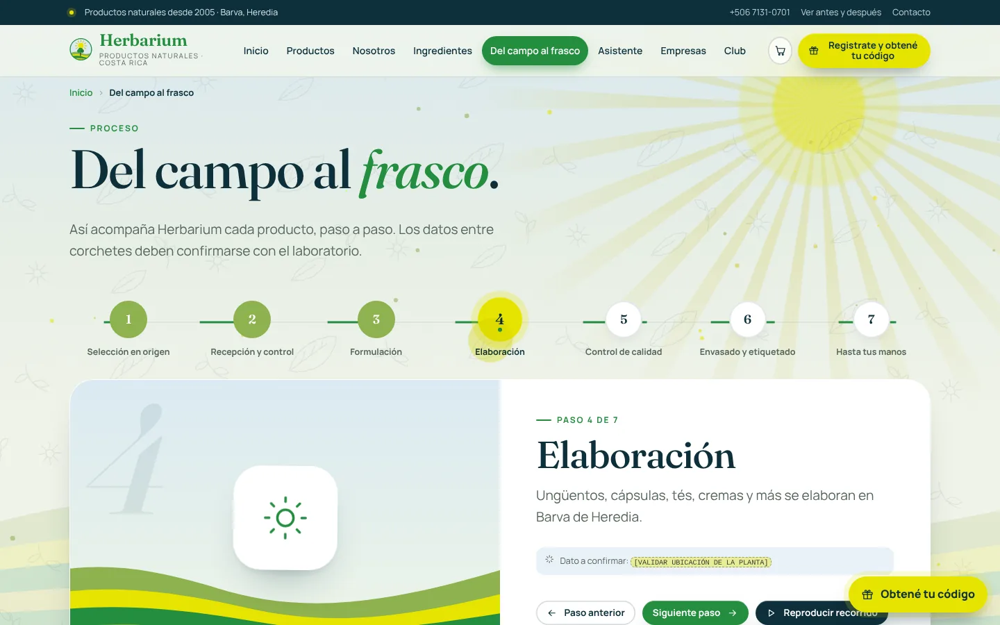
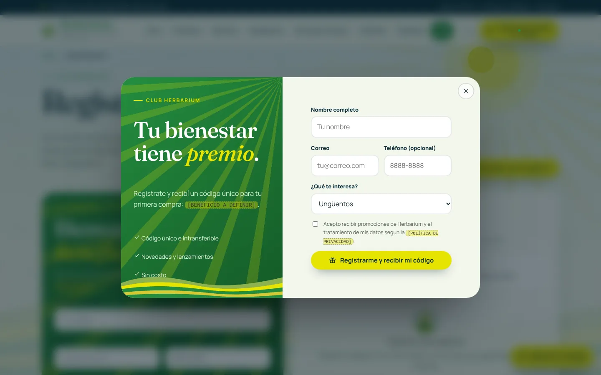
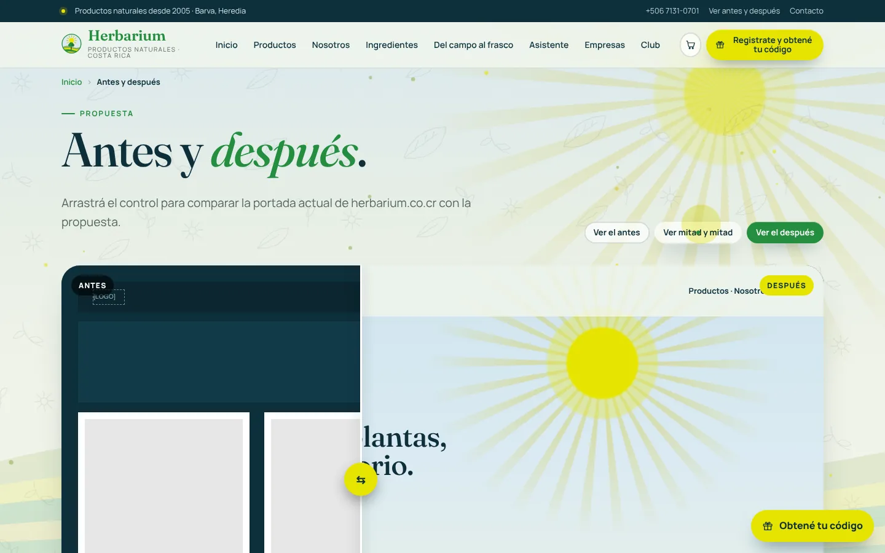
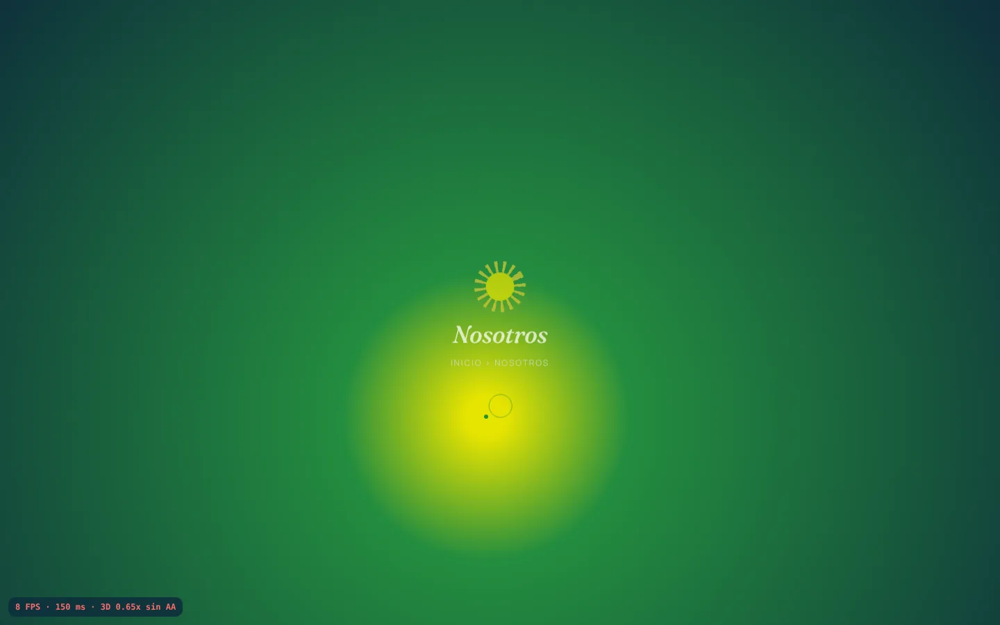

# Herbarium · Propuesta de renovación de marca y sitio web

Registro del trabajo de la demo: encargo, diagnóstico del sitio actual, decisiones, resultados y pendientes con el cliente. Para correr la demo, ver [README.md](./README.md).

## 1. Encargo

Demo para presentarle a Comercializadora Herbarium la renovación de su marca y de [herbarium.co.cr](https://herbarium.co.cr). El sitio debía verse más atractivo y con la credibilidad del sector farmacéutico.

Requisitos principales:

- **Contenido real:** las 10 categorías del sitio en su orden (Ungüentos, Cápsulas, Colágenos, Cremas, Fibra, Jarabes, Té, Shampoo, Sebo y Proteínas), con productos, precios e historia de la tienda actual.
- **Sin datos inventados:** lo que no está publicado va entre corchetes, como `[N.º REGISTRO SANITARIO]`.
- **Lenguaje de bienestar** ("ayuda a", "acompaña"), sin afirmaciones de cura o tratamiento.
- **Paleta tomada del logo:** verde Herbarium `#248D3F`, amarillo sol `#E7E401`, dorado `#D5C835`, verde campo `#8EB24F`, azul petróleo `#0E2F3B`, tierra `#403C31` y celeste cielo `#DAEAF2`.
- **Fondos con los motivos del logo:** sol con rayos, colinas en franjas, árbol, cielo y textura botánica.
- **Animación y 3D:** escena con Three.js que reacciona al mouse y una transición en cada clic.
- **Navegación no lineal:** cada sección con su propia ruta, el inicio como mapa de mosaicos, ruta de ubicación, y botones atrás y adelante funcionando.
- **Registro con promoción:** pop-up con código único, más un panel de registrados que se puede exportar.
- **Componentes validados:** selector "Para tu bienestar / Para tu marca", asistente de 3 preguntas, tarjetas de ingredientes 3D, proceso "Del campo al frasco", vista rápida, carrito, cotizador de maquila y comparador antes/después.

## 2. Diagnóstico del sitio actual

| Prioridad | Hallazgo | Propuesta |
|---|---|---|
| Alta | El banner dice "Desde el 2025", "¿Quiénes somos?" dice 2005 y un perfil externo dice 2006. | Una sola fecha de fundación en todo el sitio. |
| Alta | El mismo producto tiene precios distintos entre el listado y la ficha (Valeriana ₡7,250 y ₡6,905; Crema Facial ₡5,265 y ₡5,015; Fibra C-San ₡2,615 y ₡2,930). | Un precio único, sincronizado con el inventario. |
| Alta | Afirmaciones médicas en fichas: "regenerar los huesos", "generar cartílago", ayuda para artritis y várices. Es un riesgo regulatorio. | Lenguaje de bienestar. |
| Media | Dos shampoos sin precio visible. | Precio, o botón "Consultar disponibilidad". |
| Media | Títulos de página incompletos ("Ungüento Cascabel - - Herbarium"): se ve descuidado y perjudica en Google. | Título y descripción en cada página. |
| Media | No publican misión, visión, registro sanitario, buenas prácticas de manufactura ni regencia. | Sección Nosotros y sellos de respaldo. |
| Baja | Nombres sin tildes ni formato parejo ("CREMA FACIAL COLAGENO", "Arnica"). | Guía de estilo para nombres de producto. |
| Baja | herbariumcr.com sigue en línea, con un pie "2006-2016". | Redirigirlo al dominio oficial. |
| Baja | Fondo petróleo plano y catálogo de tienda genérico, sin caminos de decisión. | Mapa de inicio, asistente, cotizador y club. |

## 3. Ideas aplicadas

- **Dos caminos desde la portada:** "Para tu bienestar" (cliente final) y "Para tu marca" (empresas que quieren maquila). El selector cambia el texto y la escena 3D: de día con hojas, o de noche con cápsulas y frascos en órbita.
- **Fondos sacados del logo,** con textura de hojas y polen que reacciona al mouse.
- **Credibilidad de laboratorio:** sellos de registro sanitario, buenas prácticas de manufactura, regencia y trazabilidad, listos para completar.
- **Transición con el sol del logo** en cada cambio de sección.

## 4. Decisiones técnicas

- **TypeScript compilado a un solo HTML.** Un navegador no abre un archivo `.ts` con doble clic, así que el código vive en `herbarium-demo.ts` y `build.mjs` lo compila a `herbarium-demo.html`.
- **Funciona sin internet.** Three.js y las tipografías (Fraunces y Manrope, licencia OFL) van dentro del HTML, así que no depende del wifi del lugar de la presentación.
- **No se publicó en línea.** La demo usa el nombre y la marca de Herbarium y tiene un formulario que pide nombre, correo y teléfono, así que podría confundirse con el sitio oficial. Publicarla es decisión del cliente.
- **Material pendiente.** herbarium.co.cr estaba bloqueado desde el entorno donde se construyó la demo. Los datos se tomaron de las páginas que tienen indexadas los buscadores. El logo y las fotos de producto quedan como espacios para conectar (ver README).

## 5. Rendimiento (60 FPS)

Cifras medidas en un entorno sin tarjeta gráfica, donde todo se dibuja por software. Sirven para comparar antes y después, no como la velocidad real en un equipo con tarjeta gráfica.

| Escenario | Antes | Después |
|---|---|---|
| Scroll y mouse sobre productos | 24 FPS | 61 FPS |
| Transición entre secciones | 14 FPS | 54 FPS |
| Scroll en el inicio | 8 FPS | 46 FPS |
| Escena 3D quieta (por software) | 2 FPS | 11 FPS |
| Escena 3D con mouse (por software) | 2,5 FPS | 15 FPS |

La escena hace 69 llamadas de dibujo con unos 7.400 triángulos, y 14.000 en modo marca. Cualquier tarjeta gráfica la dibuja a 60 FPS. Durante la demo, la tecla **F** muestra el medidor de FPS.

Cambios principales:

- Se quitaron los desenfoques de fondo que estaban sobre fondos animados y los modos de fusión.
- Las animaciones usan solo `transform` y `opacity`.
- La escena 3D baja su calidad sola si el equipo no llega a 60 FPS.
- El polen 2D se pausa cuando la escena 3D lo tapa.

## 6. Datos a validar con el cliente

1. **Historia:** el texto exacto de "Sobre nosotros" (se armó con fragmentos indexados) y el año de fundación, 2005 o 2006.
2. **Misión, visión y valores:** son propuestas, marcadas para validar.
3. **Precios:** los que difieren entre páginas (Valeriana, Nopal, Crema Facial, Crema Corporal, Fibra C-San), si incluyen IVA (Glucoflex dice "más impuesto") y el precio de los shampoos de lavanda y de cebolla.
4. **Nombres exactos** de los colágenos para mujer, y qué es "D-F-N PLUS x90".
5. **Material gráfico:** logo y fotos de producto en alta resolución, y una captura de la portada actual.
6. **Datos técnicos:** registro sanitario, buenas prácticas de manufactura, regente, y de cada producto los ingredientes, el contenido neto, el modo de uso y el origen de la materia prima.
7. **Proceso:** confirmar los 7 pasos y la ubicación de la planta.
8. **Maquila:** presentaciones, mínimo de producción, tarifas, plazos y si acompañan el trámite de registro sanitario.
9. **Club:** qué beneficio da el código, su vigencia, la política de privacidad y si el código se envía por correo.
10. **Contacto:** si el +506 7131-0701 tiene WhatsApp, el horario de atención, el usuario de TikTok y si van a cerrar herbariumcr.com.

## 7. Capturas

| | |
|---|---|
|  |  |
|  |  |
|  |  |
|  |  |

Además: [inicio completo](./capturas/03-inicio-completo.webp), [versión móvil](./capturas/10-movil.webp) y [medidor de FPS](./capturas/11-medidor-fps.webp).

## Fuentes

[herbarium.co.cr](https://herbarium.co.cr/), [Productos](https://herbarium.co.cr/productos/), [Contáctanos](https://herbarium.co.cr/contactanos/), [fichas de producto](https://herbarium.co.cr/producto/unguento-cascabel/), [ConnectAmericas](https://connectamericas.com/es/company/comercializadora-herbarium-sa), [herbariumcr.com](https://herbariumcr.com/) y [Facebook HerbariumCR](https://www.facebook.com/HerbariumCR).
